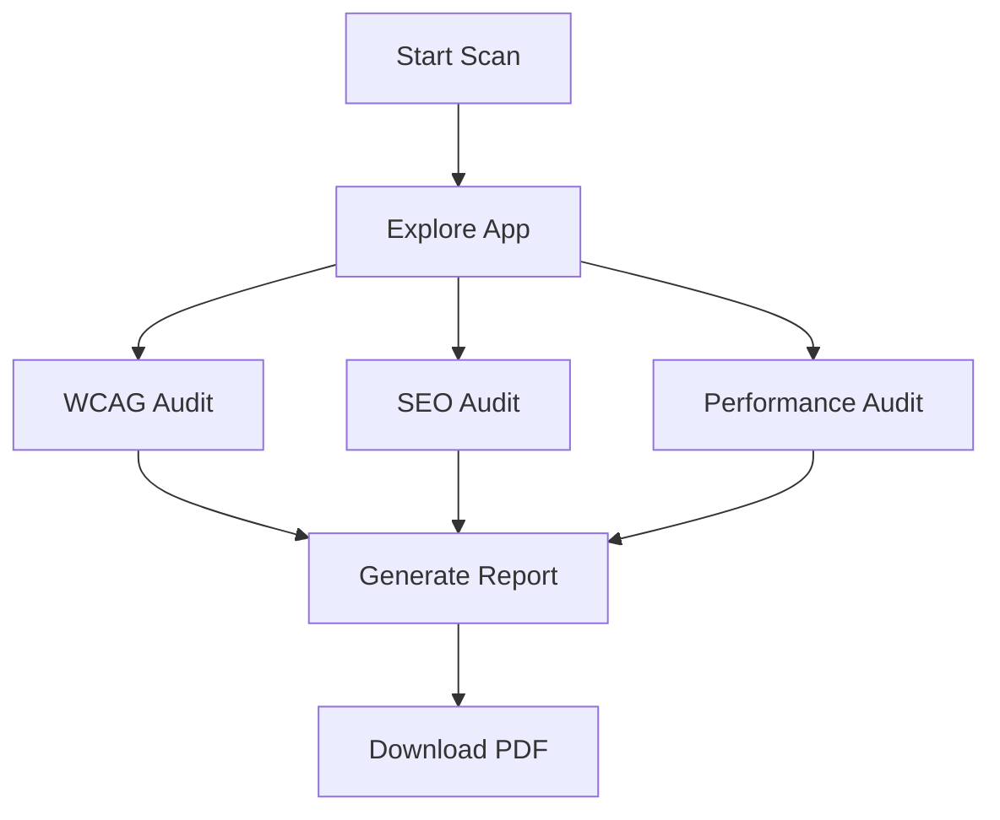

## Overview

SecuredAll delivers human-like testing for your web and mobile apps. You get automated exploration of workflows behind logins, detailed page-level reports with evidence, replayable tests you can export, and built-in audits for WCAG compliance, SEO, and performance. Start scans without writing a single test line.

<Columns cols={2}>
  <Card title="Automated Workflow Exploration" icon="zap" href="/docs/quickstart">
    SecuredAll navigates your app like a real user, handling logins and complex paths automatically.
  </Card>
  <Card title="Page-Level Issue Reports" icon="file-text" href="#page-reports">
    See exactly what failed on each page with screenshots and actionable evidence.
  </Card>
  <Card title="Replayable Test Generation" icon="play-circle" href="#test-generation">
    Export fully working Playwright tests you can run locally or in CI.
  </Card>
  <Card title="Integrated Audits" icon="shield" href="#audits">
    Get WCAG 2.2, SEO, and performance reports from your authenticated scans.
  </Card>
</Columns>

## Automated Workflow Exploration

You configure a starting URL and login details once. SecuredAll then explores your app's real workflows, signing in, clicking links, filling forms, and discovering pages dynamically.

<Steps>
  <Step title="Configure Scan" icon="settings">
    Enter your app URL and credentials in the dashboard at `https://app.securedall.com/scans/new`.
  </Step>
  <Step title="Run Exploration" icon="play">
    Select depth and modules. Scans complete in minutes.
  </Step>
  <Step title="Review Coverage" icon="eye">
    View the exploration tree and adjust for next runs.
  </Step>
</Steps>

<Callout kind="tip">
  Enable login-aware mode to test protected routes. Use test accounts to avoid production impact.
</Callout>

## Page-Level Issue Reports

Every detected issue ties back to a specific page with screenshots, DOM snapshots, and network logs. Group similar failures across runs for efficient triage.

<Tabs>
  <Tab title="Visual Failures" icon="image">
    See layout shifts, missing elements, and assertion failures with before/after images.
  </Tab>
  <Tab title="Console Errors" icon="alert-triangle">
    Capture JavaScript errors, unhandled promises, and network failures per page.
  </Tab>
  <Tab title="Accessibility" icon="accessibility">
    WCAG violations highlighted with remediation suggestions.
  </Tab>
</Tabs>

## Replayable Test Generation

SecuredAll generates complete, replayable tests from your scans. Export to Playwright for local debugging, CI integration, or team handoff.

<CodeGroup tabs="Playwright,TypeScript">
  ```javascript
  // Generated test from SecuredAll scan
  const { test, expect } = require('@playwright/test');

  test('User login workflow', async ({ page }) => {
    await page.goto('https://yourapp.com/login');
    await page.fill('[name="email"]', 'test@example.com');
    await page.fill('[name="password"]', 'your-password');
    await page.click('button[type="submit"]');
    await expect(page).toHaveURL(/dashboard/);
  });
  ```
  ```typescript
  // TypeScript variant with assertions
  import { test, expect } from '@playwright/test';

  test('Dashboard loads after login', async ({ page }) => {
    await page.goto('https://yourapp.com/login');
    await page.getByLabel('Email').fill('test@example.com');
    await page.getByLabel('Password').fill('your-password');
    await page.getByRole('button', { name: 'Sign In' }).click();
    await expect(page.locator('.welcome')).toBeVisible();
  });
  ```
</CodeGroup>

<Callout kind="info">
  Replace placeholders like `your-password` with secure variables before running in production.
</Callout>

## Integrated Audits

Run multiple audits in parallel during scans. Generate reports covering WCAG 2.2 AA, SEO best practices, and Core Web Vitals.



<Board title="Audit Roadmap">
  <BoardColumn title="Complete" color="2" icon="check-circle">
    <BoardCard title="WCAG 2.2 AA" description="Full evidence reports with manual review notes" icon="accessibility" createdAt="2024-10-01" />
    <BoardCard title="SEO Checklist" description="Meta tags, structure, and crawlability checks" />
  </BoardColumn>
  <BoardColumn title="In Progress" color="1" icon="loader">
    <BoardCard title="Lighthouse Integration" description="Performance scores with actionable fixes" dueDate="2024-12-15" author="Engineering" />
  </BoardColumn>
  <BoardColumn title="Planned" color="0" icon="circle-dot">
    <BoardCard title="Custom Audit Rules" description="Upload your own checklists" icon="file-plus" />
  </BoardColumn>
</Board>

<Expandable title="Advanced Audit Configuration" default-open="false">
  Customize thresholds in `https://app.securedall.com/settings/audits`:

  | Audit Type | Default Threshold | Configurable |
  |------------|-------------------|--------------|
  | WCAG      | AA Compliance    | Yes         |
  | SEO       | 90+ Score        | Yes         |
  | Perf      | 0.9 Cumulative   | Yes         |

  Set via API:
  ```bash
  curl -X POST https://api.securedall.com/v1/scans \
    -H "Authorization: Bearer YOUR_API_KEY" \
    -d '{"audits": {"wcag": "AA", "perf_threshold": 0.85}}'
  ```
</Expandable>