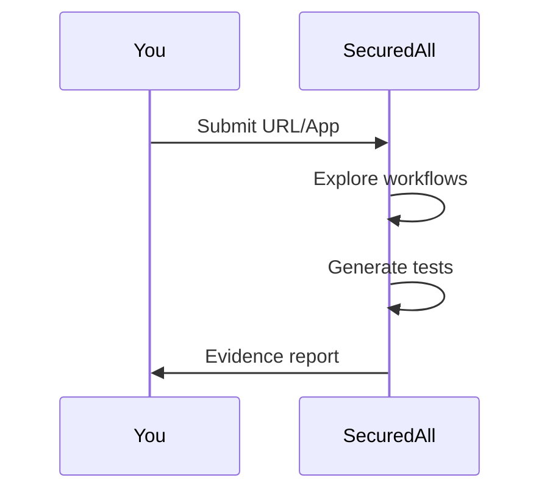

## Prerequisites

<Callout kind="info">

Before starting, ensure you have:

- A modern web browser like Chrome or Firefox
- Access to a public website URL or mobile app file (APK/IPA)
- No credit card required for the free tier

</Callout>

## Create your account

Follow these steps to sign up and access the dashboard.

<Steps>
  <Step title="Register" icon="user-plus">
    Visit `https://app.securedall.com/register` and enter your email and password.

    Create a strong password and verify your email if prompted.
  </Step>
  <Step title="Log in" icon="log-in">
    Go to `https://app.securedall.com/login` and sign in with your credentials.

    You'll land on the main dashboard.
  </Step>
</Steps>

## Set up your first workspace

Workspaces organize your scans and reports.

<Steps>
  <Step title="Create workspace" icon="folder-plus">
    Click the `New Workspace` button on the dashboard.

    Enter a name like `My First Project` and select `Free` plan.
  </Step>
  <Step title="Configure basics" icon="settings">
    Add your team members if needed, or skip to scans.

    Note the workspace ID for API use: `{workspace_id}`.
  </Step>
</Steps>

## Run your first scan

Choose between website or mobile app scanning.

<Tabs>
  <Tab title="Website" icon="globe">
    <Steps>
      <Step title="Enter URL" icon="link">
        In your workspace, click `New Scan` > `Website`.

        Paste a URL like `https://example.com`.
      </Step>
      <Step title="Start scan" icon="play">
        Select options like login flows if applicable.

        Click `Run Scan`. It explores human-like paths automatically.
      </Step>
    </Steps>

    <Request tabs="cURL" show-lines="true">
    ```bash
    curl -X POST https://api.example.com/v1/scans \
      -H "Authorization: Bearer YOUR_API_KEY" \
      -H "Content-Type: application/json" \
      -d '{
        "workspace_id": "ws_123456",
        "url": "https://example.com",
        "type": "website"
      }'
    ```
    </Request>
  </Tab>
  <Tab title="Mobile App" icon="smartphone">
    <Steps>
      <Step title="Upload app" icon="upload">
        Select `New Scan` > `Mobile App`.

        Upload your APK or IPA file.
      </Step>
      <Step title="Run test" icon="play">
        Configure device (Android/iOS) and start.

        Review auto-generated tests and evidence.
      </Step>
    </Steps>

    <Callout kind="tip">
      For private apps, provide login credentials during setup.
    </Callout>
  </Tab>
</Tabs>

## Review your results

Scans complete in minutes, providing:

- Page-level evidence screenshots
- WCAG compliance reports
- Playwright export for CI/CD
- Actionable failure details

Download the report or export tests directly from the results page.



## Next steps

<Columns cols={2}>
  <Card title="Authentication" icon="shield" href="/authentication">
    Secure scans with login-aware testing.
  </Card>
  <Card title="Advanced Guides" icon="book-open" href="/guides">
    Explore custom workflows and integrations.
  </Card>
  <Card title="API Reference" icon="code" href="/api-reference">
    Automate scans programmatically.
  </Card>
  <Card title="Changelog" icon="git-branch" href="/changelog">
    Stay updated with latest features.
  </Card>
</Columns>

<Callout kind="success">
  Congratulations! You've run your first SecuredAll scan. Customize scans for deeper coverage.
</Callout>